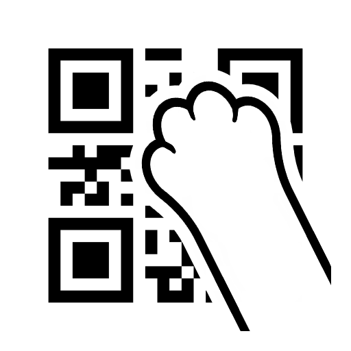

### Язык:</br>
 - [Read in English](README.md)</br>
 - [Читать на русском языке](README.ru.md)
---

<div align="middle">
    
</div>

# MyQR – локальная генерация QR-кодов

Небольшая утилита для создания и сохранения в удобном формате QR-кода по Вашему тексту или ссылке. Всё работает на вашем компьютере – ни одна ссылка не уходит в сеть.

## Скриншоты
<div align="middle">
    
    
</div>

## Особенности

- 🔒 **Полностью локально.** Ни аккаунтов, ни рекламы, ни сбора статистики: программа работает офлайн.
- 📦 **Портативная версия.** Программа не требует инсталяции и не встраивается в систему.
- ✍️ **Моментальная работа.** Работа программы ограничена только Вашим устройстом.
- 💾 **Удобный экспорт.** Сохраняйте или копируете в буфер обмена (позволяет вставить результат в Word, Figma, мессенджер, письмо и т.д.).
- 🖼️ **Выбор формата.** Вариативность для сохранения и копирования:
    - **JPG** – с фоном, как обычная картинка,
    - **PNG** – с прозрачным фоном,
    - **SVG** – вектор (без потери качества при увеличении).
- 🎨 **Выбор цветов.** Устанавливайте свои цвета как для кода, так и для фона.
- 🔧 **Настройка точности.** Позволяет установить уровни коррекции ошибок.
- 🌍 **Перевод интерфейса.** Переключайте языки интерфейса из доступного списка (список дополняется).


## Установка (Windows 10 и выше)

1. Откройте раздел [**Releases**](https://github.com/InstalerUP/MyQR/releases).
2. Скачайте файл `MyQR-vX.Y.Z-win_x64.zip`.
3. Зарахивируйте содержимое архива в отдельную папку.
4. **Установка не нужна** – это portable-приложение, запускайте файл с расширением `.exe`.

>Для **Linux** и **MacOS** Вы можете собрать проект самостоятельно по инструкции ниже.

## Техническая информация
<details>
<summary><b>Нажми, чтобы развернуть техническую информацию</b></summary>

<br />

### 📜 Система версий
Номер версии определяется по трём числам (`vX.Y.Z`):
- `X` - первое число, определяющее общий вектор развития проекта;
- `Y` - второе число, определяющее функциональную версию;
- `Z` - третье число, определяющее патчи исправления и мелких изменений.

### 🧰 Стек технологий

| Слой | Что используется |
| --- | --- |
| Рантайм | [Neutralinojs](https://neutralino.js.org/) 6.9.0 — нативное окно + локальный HTTP-сервер + WebSocket-мост к native API |
| Вебвью | WebView2 на Windows, WKWebView на macOS, WebKitGTK на Linux |
| Фронтенд | Чистый HTML + CSS + JavaScript (ES2020+), без фреймворков и сборщиков |
| QR-генерация | [qrcode-generator](https://github.com/kazuhikoarase/qrcode-generator) 1.4.4 (MIT), подключён локально как vendored-файл |
| Экспорт и буфер | Canvas 2D API, `Blob`/`toBlob()`, буфер обмена через `ClipboardItem` |
| Сборка | [Node.js](https://nodejs.org/en/download) + официальный CLI `@neutralinojs/neu`, обёрнутый в собственный `build.js` |

### 💡 Как это устроено

1. **Лёгкий рантайм вместо Electron.** Приложению не нужен «второй браузер» в комплекте: Neutralino отдаёт интерфейс в системный вебвью-компонент и общается с ним по WebSocket. В результате приложение висит очень мало.
2. **Требования.** Необходим установленный WebView2 (Windows) / WebKit (MacOS) / WebKitGTK  (Linux). Как правило, они предустановленны поумолчанию.
3. **Простая и предсказуемая деградация.** `saveFileViaDialog()` возвращает `'saved' | 'cancelled' | 'fallback'`: если приложение открыто не в нативном окне (например, `index.html` просто в браузере) или native-вызов упал — тихо включается браузерное скачивание через `a[download]`. Отмена диалога не пишет файл и не показывает лишних сообщений.
4. **Своя минималистичная локализация.** Словари — `_locales/<lang>/messages.json` (формат Chrome i18n с `message` и `description`), разметка помечается атрибутом `data-i18n`, `applyTranslations()` подставляет строки. Новый язык добавляется одним JSON-файлом и одной `<option>` в селекте: список языков код читает прямо из DOM.
5. **Настройки — в `Neutralino.storage`, а не в `localStorage`.** У приложения `"port": 0` (порт локального сервера каждый запуск случайный).

### 📁 Структура репозитория

```
MyQR/
├─ bin/                             # рантайм Neutralinojs для всех целевых платформ
├─ dist/                            # дирректория с результатом сборки
├─ resources/                       # фронтенд приложения
│  ├─ index.html                    # разметка
│  ├─ css/style.css                 # оформление
│  ├─ js/                           # скрипты приложения
│  │  ├─ main.js                    # основная логика работы приложения
│  │  ├─ qrcode.min.js              # сторонняя библиотека генератор QR (qrcode-generator)
│  │  └─ neutralino.js (+ .d.ts)    # клиентская библиотека Neutralino и типы
│  ├─ img/                          # используемые изображения
│  └─ _locales/                     # дирректория файлов локализации
│     └─ {ru,en}/                   # сортировка по языку
│       └─ messages.json            # .json файл перевода
├─ neutralino.config.json           # конфигурация приложение-система
├─ build.js                         # кастомный скрипт сборки приложения
└─ LICENSE                          # используемая лицензия
```

### 🚀 Локальный запуск для разработки

Понадобится [Node.js v18+ (LTS)](https://nodejs.org/en/download).

```bash
# 1. Клонируем репозиторий
git clone https://github.com/InstalerUP/MyQR.git
cd MyQR

# 2. Ставим CLI Neutralino (один раз на машину)
npm install -g @neutralinojs/neu
#    вариант без глобальной установки:
#    npm install -D @neutralinojs/neu && npx neu run

# 3. (опционально) обновляем рантайм в bin/ под версию из конфига
neu update

# 4. Запускаем в dev-режиме: окно приложения + живая перезагрузка при правках
neu run
```

### 🏗 Сборка релиза

**Сборка под Windows через скрипт.** В результате в дирректории `dist/` появится архив `.zip` с необходимым для запуска под windows.
```bash 
node build.js
```
---
**Сборка под Windows без скрипта.**
```bash
neu build --win
```
---
**Сборка под macOS без скрипта.** Для запуска требуется macOS 11.0 (Big Sur) и выше.
```bash
neu build --mac --macos-bundle
```
---
**Сборка под Linux без скрипта.** Подойдёт для систем основанных на Debian / Arch / Fedora.
```bash
neu build --linux
```
---

### 📄 Лицензия

Проект распространяется под лицензией **MIT** — используйте, изменяйте и встраивайте свободно (подробности в [LICENSE](LICENSE)).

</details>

